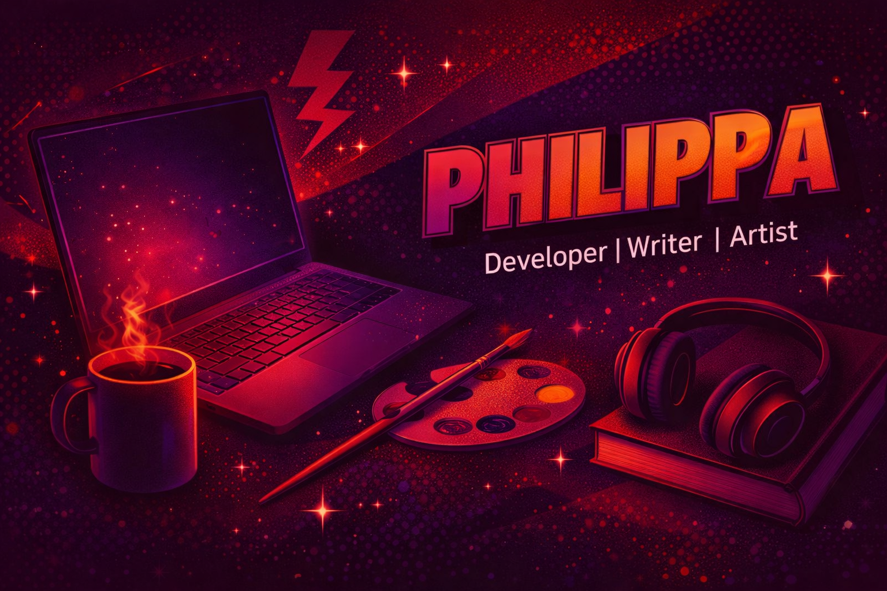

<!--
    Dear user, using my README as a base
    To create your own, I’m happy to authorise its use 
    And I’m glad you liked it! I just kindly ask for one thing:

    Please, leave a star on my README, it would truly make my day :)
    GitHub: https://github.com/PhiLouGii
-->

<!-- Banner  -->

  <a href="https://api.github-star-counter.workers.dev/user/PhiLouGii">
     
  </a>
  <a href="https://api.github-star-counter.workers.dev/user/PhiLouGii">
     
  </a>
  

 

<!-- Who am i? -->

**Who Am I?**

I'm a Software Engineer freshly done with my degree at African Leadership University in Kigali. I build full-stack web apps, mobile apps, and somehow also find time to write novels. I care deeply about making technology that actually means something — especially for African communities. When I'm not coding, I'm probably designing something, writing another novel, or brainstorming for a new idea.

Over time, I have developed **solid experience** across the **web development ecosystem**, with a strong passion for `Front-End Development`, where **logic meets creativity and visual design**. Alongside web technologies, I have expanded my skills into **mobile development**, focusing on building modern applications using `Android Studio`.

 
 

<!-- badges -->

  <strong>You can Click here</strong>
   

  <!-- Pinterest -->
  
  <!-- Linkedin -->
  
  <!-- GMail  -->
  

 

> [!Caution]
>
>“It works on my machine.” — Every developer ever.
>
> If at first you don’t succeed, call it version 1.0.

 

<table align="center">
  <tr>
    <!-- Skills Left -->
    <td valign="top" width="45%">
      
       
       
       
       
       
       
       
    </td>
    <!---->
    <td valign="top" width="55%">

    </td>
  </tr>
</table>

<!--

-->
